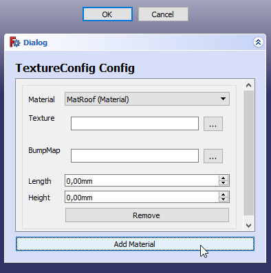
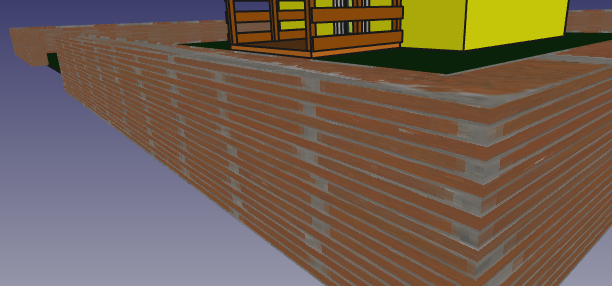
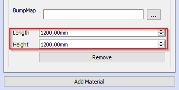
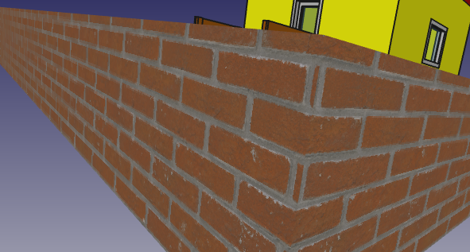
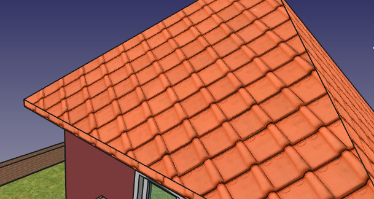
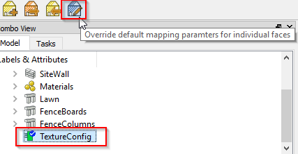
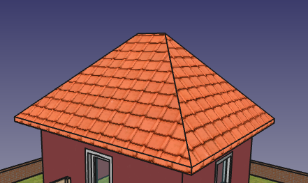

# FreeCAD-ArchTextures

This workbench allows you to add textures to architectural objects directly in FreeCAD. No need for third party sofware, as long as you don't want to produce photorealistic renderings.

## Motivation
I was working on a arch project in FreeCAD. When the geometry was pretty much finished I decided that the building needs some texturing. This will help dramatically in understanding the overall idea (This is made from wood, there are bricks,...). I know Blender a bit and can produce texture materials that look quite good (at least for me :D) but I am lazy. I don't want to switch back and force between applications when something changes. And as my goal was not to create photorealistic renderings, i decided to do it in FreeCAD.


## Getting started

<details>
    <summary>
This section gives you a step by step instruction on how to add textures to a FreeCAD project. It will guide you through the process of texturing a small building. We start here


and should finnaly end up here


    </summary>

**The workbench works with FreeCAD 0.18 Python 3 and Python 2 builds. It might also work with older versions but is not tested so far**

1. At first download and open the "House.FCStd" file located unter "Resources/Documentation" in the repository. Or start with whatever arch project you want. Now you should see this building in the 3D View


2. Next switch to the Arch Texture Workbench and click the "Create TextureConfig" icon


3. Now the object should be visible in the TreeView. TextureConfigs are hidden by default when we create them and when the document loads. This is done to prevent excessive loading times on startup.


4. Now lets start texturing. Double click the TextureConfig object to display the task panel to set up some textures. After clicking the "Add Material" button, you should see something like this



5. Select ```MatBricks``` in the Material Combo Box and double click the "Texture File" column. Select a brick texture from your file system (I used textures from https://www.textures.com/). After you click "OK" nothing will happen because the TextureConfig is still hidden.

6. Select the TextureConfig in the Tree View and hit the "Space" key. This will add the texture in our config to all objects with the "MatBricks" materials. When hiding the TextureConfig again, the textures will be removed from the 3D View. When the textures are visible you should see something like this



But wait! This does not really look like a brick wall at all. The texture is stretched pretty badly. But this is easy to fix.

7. Double click the TextureConfig again and add the real size of the texture. The bricks texture I used is about 1200x1200 mm in size. If the size of the texture is not given, simply google the size of a single brick and multiply it with the number of bricks in your texture.



8. Click "OK" and check the 3D View again. Now it looks much more like a real brick wall.



9. Repeat the above steps for all other materials and you should end up with something like this


10. Most of the textures look good. But it might be, that the roof does not look like expected. The texture should be mapped so that the lines run horizontally but they run oblique accross the faces.



But this is pretty easy to fix. Select the TextureConfig in the TreeView and click the "Configure Faces" button.



Now enter the angle in degrees you want to rotate a certain face. Positive values rotate the texture clockwise and negative values counter clockwise. For our roof a rotation of 55 degrees for the front and back faces and -55 degrees for the side faces should work pretty well. Now select the faces you want to set the rotation for and click "Apply". The rotation is applied immediately. You have to unselect the faces to see the rotated texture.


</details>

## Troubleshooting

When something happens and you end up with broken textures or a broken 3D View (e.g. you deleted the TextureConfig before hiding it) you can always close the document and reopen it. The TextureConfig is hidden by default and no textures will be shown after a reload.

## Texture mapping

When mapping the texture to a face the algorithm works as follows:

 1. When the real size is set and the texture is not quadratic, the algorithm maps the longest side of the texture to the longest side of the face
 2. When the real size is not set or the texture is quadratic, the algorithm maps the "s" side of the texture to the longest side of the face

## Technical details
<details>
    <summary>
    This section gives some insight on the technical part of the workbench. This is mainly some documentation for me so that I still know in a year or two whats going on in this workbench. But maybe some aspects could be interesting for others too.
    </summary>

First, it is relative easy to add textures to objects in FreeCAD. Found this forum thread (https://forum.freecadweb.org/viewtopic.php?f=38&t=7216) that shows, adding a texture is only 3 lines of code. But mapping textures right on to an object involves a bit more code.

### General steps to map textures
1. Create a SoTexture2 object and set the ```filename``` to a image file
3. Create a SoTextureCoordinate2 object and set the points array to map the vertex coordinates of the geometry
4. Add both to the rootNode of your object and the texture should show up

### TextureConfig
The texture config holds all the informations about materials and the textures to apply to them. When displayed the textures will be added to the objects, when hidden the textures are removed.

### TextureManager
The texture manager does the heavy lifting. It keeps track of all textures and the textured objects and can add/remove textures to/from objects.

When texturing objects the texture manager looks for arch objects with a material assigned. When the material is found in the texture config it will use the settings to texture the object.

The texturing process is as follows:
1. We get the RootNode of the object
2. We search for the Coordinate3 node in the RootNode. This node contains a list of all vertices our object consists.
3. We search for the SoBrepFaceSet in the RootNode. This is the object that contains the face informations
    - This object has a list of vertex indices that map to the vertices in the Coordinate3 object
    - It also has a list of faces. This describe the number of triangles that form a face of the object.
    - It also contains a textureCoordinate field that works like the coordinate indices but for textures. **This should normally be the same as the coord index field or it should be empty** But FreeCAD sets it to -1. So we have to override it with the coordIndex field to get correct textures.
4. Based on the FaceSet and the Coordinate3 object we calculate the vertices that make up each face.
    - We group the vertex indices by triangles. Each triangle is separated by a ```-1```.
    - Then we use the partIndex field to get the number of triangles per face and build the face list from this information
5. When we have the faces of our object we need to calculate the texture coordinates for this face. See ```Calculating texture coordinates``` for further details.
6. When we have all the informations we need, we simply add the required nodes to the scene graph and the textures show up.

### Calculating texture coordinates
This is the trickiest part in the process. The basic idea is pretty simple:

1. Move each face to the origin
2. Rotate each face that is maps the XZ plane
3. Move each face so that it is in the positive X and Z quadrant
4. Calculate the bounding box for the face
5. Map the image to match the bounding box

#### 1. Move each face to the origin
This is pretty straight forward. As we know the first three vertices of our face always form a triangle, we use the first one as our offset and subtract it from each vertex in the face. So the first vertex matches the origin and the others, moved by the same amount, still form our original face

#### 2. Rotate each faceso it maps the XZ plane
This was pretty tricky to figure out (At least for me as I'm not a specialist in Matrix transformations and so on).

The general idea behind it is:
1. Calculate the local coordinate system for our face
2. Create a matrix that transforms our local coordinate system to the global one
3. Multiply each vertex with the matrix

Calculate the local coordinate system:
 - We make use of the fact, that the first three vertices for a triangle. This triangle is our local coordinate system.
 - The Y-Axis maps to the triangles normal vector. This ensures, that the normal will face the Front plane later on as this is also the Y axis in the global coordinate system.
 - The X-Axis is the shortest line starting from the first vector. This ensures that we don't use the diagonal of the triangle as our axis. Else the face would be twisted in the front plane.
 - The Z-Axis is simply the cross product of the other two axis

Calculate the matrix:
 - First we normalize our local coordinate system. Otherwise we would scale our face when mapping it to the front plane
 - Then the rotation matrix is simply a dot product of the normalized local axis and the global axis
```python
FreeCAD.Matrix(normalizedX.dot(globalX), normalizedX.dot(globalY), normalizedX.dot(globalZ), 0,
    normalizedY.dot(globalX), normalizedY.dot(globalY), normalizedY.dot(globalZ), 0,
    normalizedZ.dot(globalX), normalizedZ.dot(globalY), normalizedZ.dot(globalZ), 0,
    0, 0, 0, 1)
```

#### 3. Move each face so that it is in the positive X and Z quadrant
Now we can end up with faces that have vertices with a negative Z or X value. We want them all to be positive so that we can use this informations later on and simply use our bounding box to calculate the texture coordinates.

To do so we check the Minimum X and minimum Z values of our face. If one is less than 0 we transform all vertices in the face by this amount in the positive direction. Now the smalles values will be 0 and everything else should be in the positive axis.

#### 4. Calculate the bounding box for the face
Now that everything is in the positive XZ plane we can simply use the smallest XYZ and biggest XYZ values to form our bounding box.

#### 5. Map the image to match the bounding box
Basically the image should map our bouding box. That means the lower left corner of the image maps to the lower left corner of our bounding box (XMin, YMin, ZMin) and the upper right corner of the image maps to the upper right corner of our bounding box (XMax, YMax, ZMax).

When the user sets the ```realSize``` property of the texture config, we use this informatoins to calculate a scale for the image first. Lets say the face is 2x2 meters in size. And the image has a real size of 1x1 meters. Than we have to repeat the texture 2 times in each direction to get it scaled right.

After we know how big the image should be we simply calculate each vertex coordinate relative to the bounding box. Lets say we have a vertex in the middle of our image. It should map to the 0.5/0.5 coordinates of the image.

</details>

## Support
Found a bug? Have a nice feature request? simply create an issue in this repository or post to this FreeCAD Forum thread https://forum.freecadweb.org/viewtopic.php?f=9&t=31598.
